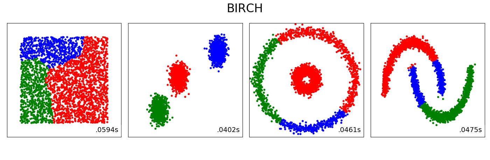

# Supplementary material for the BCTP Lecture Series

On this Github repository, I collect files I coded during the afternoon sessions of the BCTP Lecture Series [Machine Learning and its Applications](https://indico.desy.de/indico/event/23325/). Note that all examples can be drastically improved. The point is not to find the best neural network, but to illustrate the concepts we have discussed in class.

## Monday
In this session, we created our first feed-forward neural network that learns the xor function. We implemented the neural network in Mathematica, Keras (with tensorflow backend), and PyTorch. The files are available [here](./Monday).


## Tuesday
In this session, we created our first convolutional neural network using PyTorch. We classify galaxies into spiral, elliptical or unknown. The data is provided by the [Galaxy Zoo](https://data.galaxyzoo.org) project. See [http://adsabs.harvard.edu/abs/2008MNRAS.389.1179L](http://adsabs.harvard.edu/abs/2008MNRAS.389.1179L) for more details. The pictures of the galaxies themselves are provided by the [Sloane Digital Sky Survey](https://www.sdss.org). The files are available [here](./Tuesday).

NN predicting this is a spiral galaxy:

 

(Image source: [https://www.sdss.org](https://www.sdss.org))

## Wednesday
In this session, we demonstrated how to code an environment that can be connected via the OpenAI gym to [ChainerRL](https://github.com/chainer/chainerrl). We illustrate how the the A3C agent finds good energy configurations for the 1D Ising model by flipping spins at any of the lattice sites. The files are available [here](./Wednesday).

```
I found an optimal configuration!
↑ ↑ ↑ ↑ ↑ ↑ ↑ ↑ ↑ ↑ ↑ ↑ ↑ ↑ ↑ 
I started from
↑ ↑ ↓ ↓ ↑ ↑ ↑ ↑ ↑ ↓ ↓ ↑ ↓ ↑ ↑ 
and took the actions
[10, 2, 3, 9, 12]
``` 

## Thursday
In this session, we illustrate the unsupervised clustering algorithms (k-means, mean shift, DBSCAN, Birch) we discussed in class using [scikit learn](https://scikit-learn.org/stable/). The files are available [here](./Thursday).

  

  
