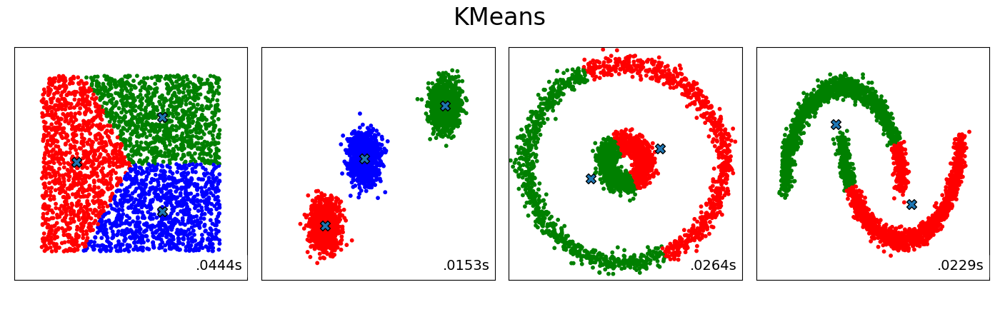
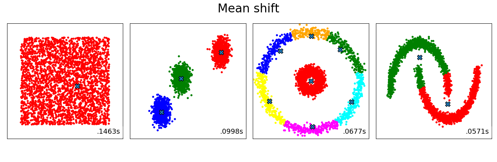
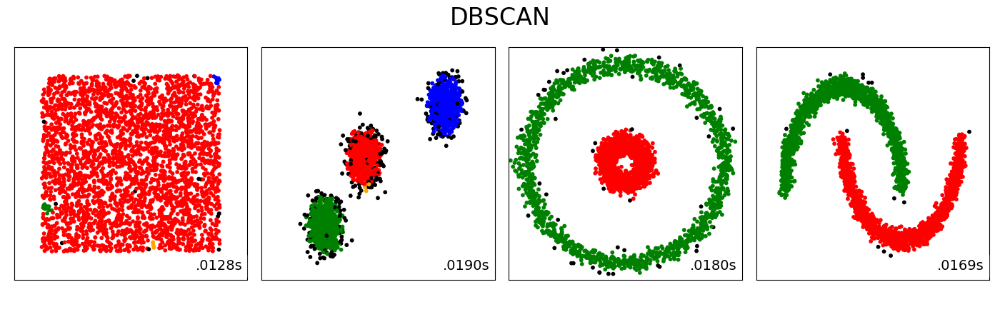

# Examples of the Thursday afternoon coding session

We illustrated several unsupervised clustering algorithms we discussed in class. We used the [scikit learn]() implementations of these algorithms.

## K Means
Note the Voronoi diagram abehavior (best visible for clustering of uniform data points). We set the number of clusters k to 3,3,2,2, respectively.\

  

## Mean Shift
Note the longer running time, as well as the Voronoi diagrams.

## DBSCAN
Note that the nested circles and the half-moons are identified as separate clusters. Outliers are colored in black.

  

## Birch
Note that here no Voronoi diagram emerges for the cluster boundaries.

